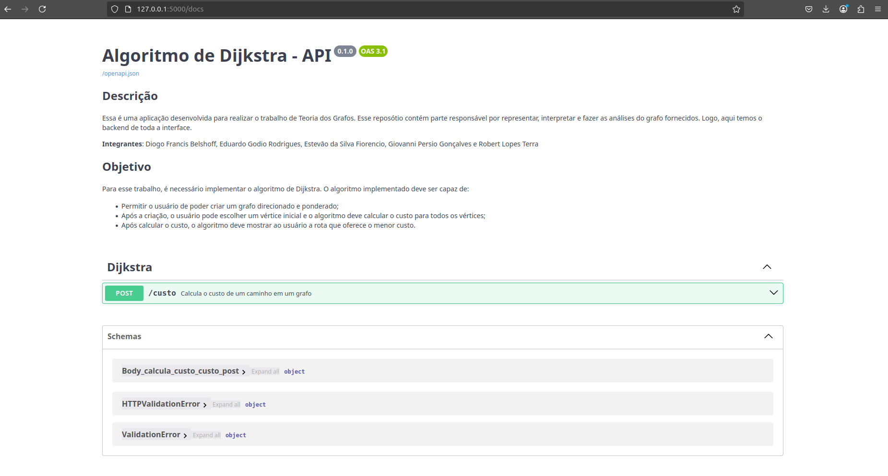

# dijkstra-algorithm
Aplicação do algoritmo de Dijkstra em Python

## Descrição
Essa é uma aplicação desenvolvida para realizar o trabalho de Teoria dos Grafos. Esse reposótio contém parte responsável por representar, interpretar e fazer as análises do grafo fornecidos. Logo, aqui temos o backend de toda a interface.

**Integrantes**: Diogo Francis Belshoff, Eduardo Godio Rodrigues, Estevão da Silva Fiorencio, Giovanni Persio Gonçalves e Robert Lopes Terra


## Objetivo
Para esse trabalho, é necessário implementar o algoritmo de Dijkstra. O algoritmo implementado deve ser capaz de:
- Permitir o  usuário de poder criar um grafo direcionado e ponderado;
- Após a criação, o usuário pode escolher um vértice inicial e o algoritmo deve calcular o custo para todos os vértices;
- Após calcular o custo, o algoritmo deve mostrar ao usuário a rota que oferece o menor custo.

## Requisitos

### Instalação - Poetry (Recomendado)
O projeto é gerenciado pelo `poetry`. Caso não tenha o poetry instalado. Faça:

```bash
pip install poetry
```
Após instalar o poetry globalmente em sua maquina, faça:

```bash
poetry install
```
A partir disso, o poetry irá instalar todas as dependências dentro de um ambiente virtual (venv).

### Instalação -  requirements.txt
Caso não deseja seguir por esse opção, apenas use:

```bash
pip install -r requirements.txt
```

> Obs: Sempre é recomendado você criar um ambiente virtual antes de instalar um pacote python usando `python -m venv .venv`. Se possível, pesquise mais sobre. Não é nada grave criar sem. Porém, é recomendado

### Execução do projeto

Para executar o projeto em sua maquina, use:
```bash
uvicorn main:app --reload --factory --port 5000     
```

Inicialmente, o FastAPi + Uvicorn irá disponibilizar o ip `http://127.0.0.1:5000` para você observar o `swagger` da aplicação. No entanto, por padrão você deve acessar [http://127.0.0.1:5000/docs](http://127.0.0.1:5000/docs). Por padrão, esse é o endereço usado observer as rotas e poder testa-las apartir de swagger OpeanAPI

